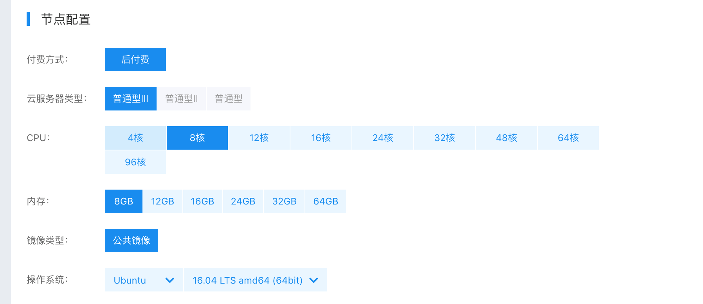
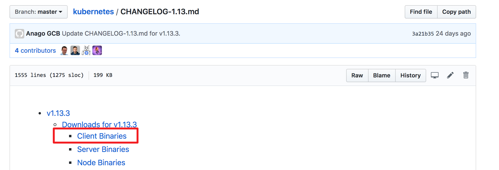
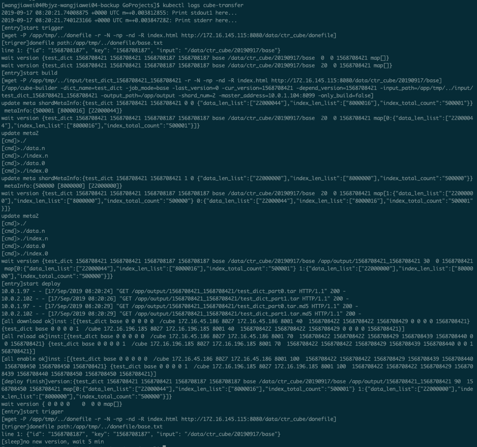
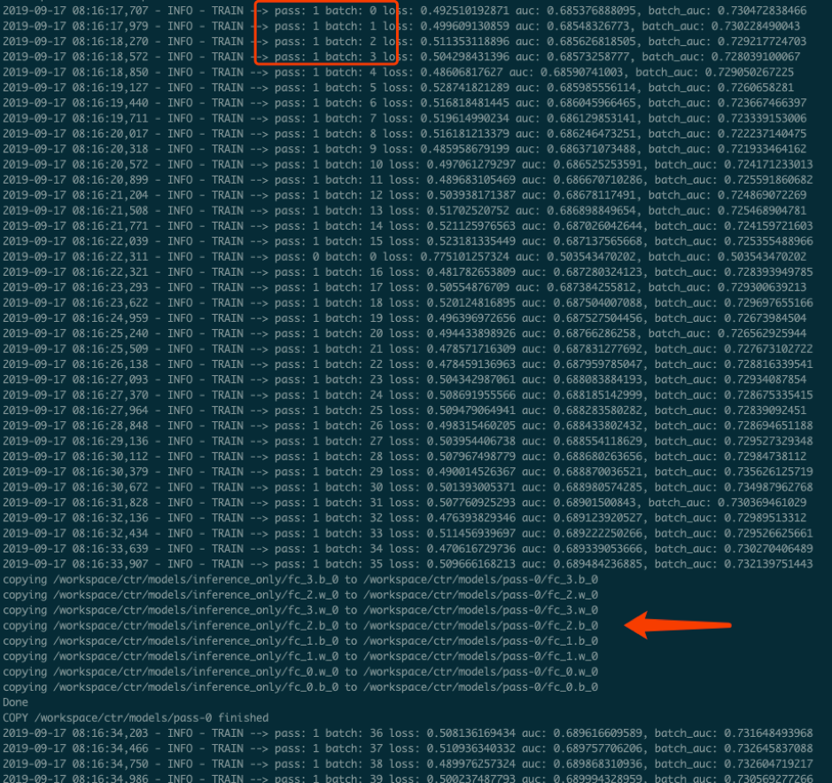
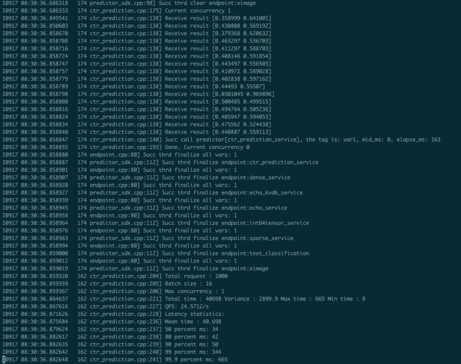
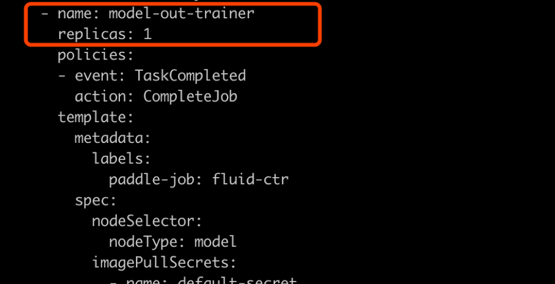
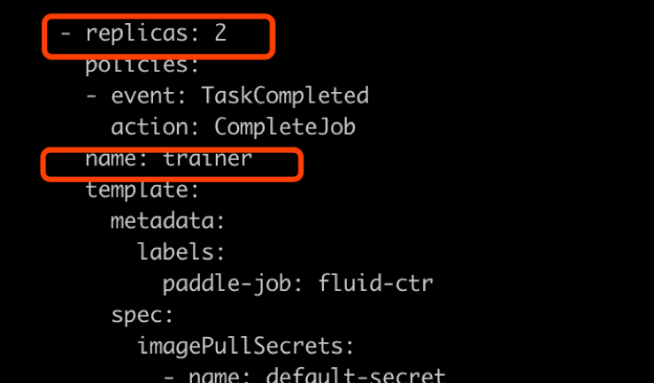

百度云分布式训练CTR
===================

1. 总体概览
-----------


本项目提供了端到端的CTR训练和二次开发的解决方案，它具有如下特点。

-   使用K8S集群解决来解决原来在物理集群上训练时，会出现类似于配置参数冗杂，环境搭建繁复等问题。
-   使用基于Kube-batch开发的Volcano框架来进行任务提交和弹性调度。
-   使用Paddle Serving来进行模型的上线和预测。
-   使用Cube作为稀疏参数的分布式存储，在预测对接Paddle Serving使用。

以上组件就可以一键完成从训练到部署的所有流程。

此外，我们在各个环节也提供了二次开发的指导。具体有如下方式

-   指定数据集的输入和读取方式，来feed不同的数据集和数据集格式
-   通过指定训练的规模，包括参数服务器的数量和训练节点的数量。
-   通过指定Cube参数服务器的分片数量和副本数量。
-   指定Serving的模型信息

2. 创建集群
-----------

具体请参考
[帮助文档](https://cloud.baidu.com/doc/CCE/GettingStarted/24.5C.E5.88.9B.E5.BB.BA.E9.9B.86.E7.BE.A4.html#.E6.93.8D.E4.BD.9C.E6.AD.A5.E9.AA.A4)
说明文档来建立一个集群。

集群配置需要满足如下要求

-   CPU核数 \> 4

示例图



创建完成后，即可查看
[集群信息](https://cloud.baidu.com/doc/CCE/GettingStarted.html#.E6.9F.A5.E7.9C.8B.E9.9B.86.E7.BE.A4)
。

3. 操作集群
-----------

集群的操作可以通过百度云web或者通过kubectl工具进行，推荐用
[kubectl工具](https://kubernetes.io/docs/tasks/tools/install-kubectl/)
。

从Kubernetes 版本下载页面下载对应的 kubectl 客户端，关于kubectl
的其他信息，可以参见kubernetes官方安装和设置 kubectl文档。



\* 注意： 本操作指南给出的操作步骤都是基于linux操作环境的。

-   解压下载后的文件，为kubectl添加执行权限，并放在PATH下

``` {.sourceCode .bash}
cd kubernetes/client/bin && chmod +x ./kubectl && sudo mv ./kubectl /usr/local/bin/kubectl
```

-   配置kubectl，下载集群凭证。在集群界面下载集群配置文件，放在kubectl的默认配置路径（请检查\~/.kube
    目录是否存在，若没有请创建）

``` {.sourceCode .bash}
mv kubectl.conf  ~/.kube/config
```

-   配置完成后，您即可以使用 kubectl 从本地计算机访问 Kubernetes 集群

``` {.sourceCode .bash}
kubectl get node
```

4. 部署任务
-----------

### 安装Volcano

执行

``` {.sourceCode .bash}
kubectl apply -f https://raw.githubusercontent.com/volcano-sh/volcano/master/installer/volcano-development.yaml
```


### 一键完成部署

执行

``` {.sourceCode .bash}
bash paddle-suite.sh
```

为方便理解，接下来会将该脚本的每一步执行过程给出说明

任务的所有脚本文件可以访问
[这里](https://github.com/PaddlePaddle/edl/tree/develop/example/ctr/script)
获取。

选择一个node作为输出节点 ::::::::::::

``` {.sourceCode .bash}
kubectl label nodes $NODE_NAME nodeType=model
```

这句话的意思是给这个node做一个标记，之后的文件服务和模型产出都被强制分配在这个node上进行，把NAME的一串字符
替换 \$NODE\_NAME即可。

#### 启动文件服务器

``` {.sourceCode .bash}
kubectl apply -f fileserver.yaml
```

运行file server的启动脚本kubectl apply -f ftp.yaml，启动文件服务器


启动Cube稀疏参数服务器 ::::::::::

``` {.sourceCode .bash}
kubectl apply -f cube.yaml
```

如果在Service中发现了cube-0/1，在kubectl get
svc中发现了相关的服务，则说明cube server/agent启动成功。


启动Paddle Serving ::::::::::

``` {.sourceCode .bash}
kubectl apply -f paddleserving.yaml
```

如果在Service中发现了paddle serving，在kubectl get
svc中发现了相关的服务，则说明paddle serving启动成功。


启动Cube稀疏参数服务器配送工具 ::::::::::::

``` {.sourceCode .bash}
kubectl apply -f transfer.yaml
```



这个cube-transfer配送工具会把训练好的模型从下面要介绍的edl-demo-trainer-0上通过file
server拉取，再进行装载。最终目的是给Paddle
Serving来进行稀疏参数查询。如果出现最后wait 5
min这样的字样，说明上一轮的模型已经配送成功了，接下来就可以做最后Paddle
Serving的测试了。

执行 Paddle CTR 分布式训练 :::::::::::::

``` {.sourceCode .bash}
kubectl apply -f ctr.yaml
```

接下来需要等待一段时间，我们可以通过kubectl logs
edl-demo-trainer-0来查看训练的进度，如果pass
一直为0就继续等待，通常需要大概3-5分钟的之间会完成第一轮pass，这时候就会生成inference\_model。


5. 查看结果
-----------

### 查看训练日志

百度云容器引擎CCE提供了web操作台方便查看pod的运行状态。

本次训练任务将启动3个pserver节点，3个trainer节点。

可以通过检查pserver和trainer的log来检查任务运行状态。 Trainer日志示例：



pserver日志示例：


验证Paddle Serving预测结果 \>\>\>\>\>\>\>\>\>\>\>\>

执行

``` {.sourceCode .bash}
kubectl apply -f paddleclient.yaml
```

在/client/ctr\_prediction目录下，执行

``` {.sourceCode .bash}
bin/ctr_prediction
```

如果运行正常的话，会在一段时间后退出，紧接着就可以在log/ctr\_prediction.INFO的最后几行看到类似于这样的日志



6. 二次开发指南
---------------

指定数据集的输入和读取方式 \>\>\>\>\>\>\>\>\>\>\>\>

现有的数据的输入是从edldemo镜像当中的/workspace/ctr/data/download.sh目录进行下载。下载之后会解压在/workspace/ctr/data/raw文件夹当中，包含train.txt和test.txt。所有的数据的每一行通过空格隔开40个属性。

然后在train.py当中给出数据集的读取方式


这里面包含了连续数据和离散数据。 连续数据是index [1,
14)，离散数据是index [14, 40)，label是index 0，分别对应最后yield
[dense\_feature] + sparse\_feature +
[label]。当离散的数据和连续的数据格式和样例有不同，需要用户在这里进行指定，并且可以在\_\_init\_\_函数当中参考样例的写法对连续数据进行归一化。

对于数据的来源，文章给出的是download.sh从Criteo官方去下载数据集，然后解压后放在raw文件夹。

可以用HDFS/AFS或是其他方式来配送数据集，在启动项中加入相关命令。

在改动之后，记得保存相关的docker镜像并推送到云端

``` {.sourceCode .bash}
docker commit ${DOCKER_CONTAINER_NAME} ${DOCKER_IMAGE_NAME}
    docker push  ${DOCKER_IMAGE_NAME}
```

也可以在Dockerfile当中进行修改

``` {.sourceCode .bash}
docker build -t ${DOCKER_IMAGE_NAME} .
    docker push  ${DOCKER_IMAGE_NAME}
```

### 指定训练规模

在ctr.yaml文件当中，我们会发现这个是在volcano的框架下定义的Job。在Job里面，我们给出了很多Pserver和Trainer的定义，在总体的Job也给出了MinAvailable数量的定义。Pserver和Trainer下面有自己的Replicas，环境变量当中有PSERVER\_NUM和TRAINER\_MODEL和TRAINER\_NUM的数量。通常MinAvailable
= PServer Num + Trainer Num，这样我们就可以启动相应的服务。


如上图所示，我们需要在min\_available处设置合理的数字。例如一个POD占用一个CPU，那么我们就要对集群的总CPU数有一个预估，不要过于接近或事超过集群CPU总和的上限。否则无法满足Volcano的Gang-Schedule机制，就会出现无法分配资源，一直处于Pending的情况。然后第二个红框当中是



如上图所示，这个部分是用来专门做模型的输出，这里我们不需要做任何的改动，只要保留一个副本就可以。



如上图所示

指定cube参数服务器的分片数量和副本数量 \>\>\>\>\>\>\>\>\>\>\>\>

在cube.yaml文件当中，我们可以看到每一个cube的节点的定义，有一个cube
server pod和cube server
service。如果我们需要增加cube的副本数和分片数，只需要在yaml文件中复制相关的定义和环境变量即可。


以上两个图片，一个是对cube POD的定义，一个是对cube
SERVICE的定义。如果需要扩展Cube分片数量，可以复制POD和SERVICE的定义，并重命名它们。示例程序给出的是2个分片，复制之后第3个可以命名为cube-2。

### Serving适配新的模型

在本示例中，所有训练的模型，都可以自动地被Serving获取，但是，我们如果需要别的模型，就需要自行去配置相关的信息。具体可以参见
[Serving从零开始写一个预测服务](https://github.com/PaddlePaddle/Serving/blob/develop/doc/CREATING.md)
